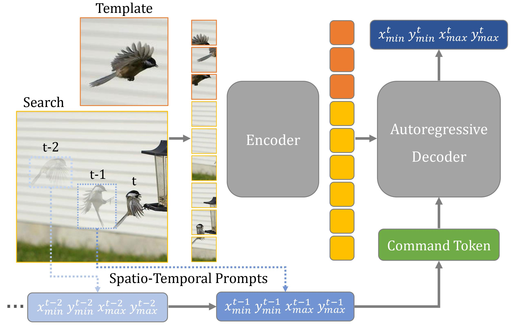

# ARTrack

The official PyTorch implementation of our **CVPR 2023 Highlight** paper:

**Autoregressive Visual Trecking**

GitHub maintainer: [Yifan Bai](https://github.com/AlexDotHam)

[[CVF Open Access](https://openaccess.thecvf.com/content/CVPR2023/papers/Wei_Autoregressive_Visual_Tracking_CVPR_2023_paper.pdf)] 

[](https://paperswithcode.com/sota/visual-object-tracking-on-got-10k?p=autoregressive-visual-tracking)
[](https://paperswithcode.com/sota/visual-object-tracking-on-tnl2k?p=autoregressive-visual-tracking)
[](https://paperswithcode.com/sota/visual-object-tracking-on-lasot?p=autoregressive-visual-tracking)
[](https://paperswithcode.com/sota/visual-object-tracking-on-trackingnet?p=autoregressive-visual-tracking)
[](https://paperswithcode.com/sota/visual-object-tracking-on-lasot-ext?p=autoregressive-visual-tracking)
[](https://paperswithcode.com/sota/visual-object-tracking-on-uav123?p=autoregressive-visual-tracking)

## Highlight



### :bookmark:Brief Introduction

We present **ARTrack**, an autoregressive framework for visual object tracking. ARTrack tackles tracking as a coordinate sequence interpretation task that estimates object trajectories progressively, where the current estimate is induced by previous states and in turn affects subsequences. This time-autoregressive approach models the sequential evolution of trajectories to keep tracing the object **across frames**, making it superior to existing template matching based trackers that only consider the **per-frame** localization accuracy. ARTrack is simple and direct, eliminating customized localization heads and post-processings. Despite its simplicity, ARTrack achieves state-of-the-art performance on prevailing benchmark datasets.
### :bookmark:Strong Performance

|             Variant             |       ARTrack-256       |       ARTrack-384       |      ARTrack-L-384      |
|:-------------------------------:|:-----------------------:|:-----------------------:|:-----------------------:|
|          Model Config           | ViT-B, 256^2 resolution | ViT-B, 384^2 resolution | ViT-L, 384^2 resolution |
| GOT-10k (AO / SR 0.5 / SR 0.75) |   73.5 / 82.2 / 70.9    |   75.5 / 84.3 / 74.3    |   78.5 / 87.4 / 77.8    |
|    LaSOT (AUC / Norm P / P)     |   70.4 / 79.5 / 76.6    |   72.6 / 81.7 / 79.1    |   73.1 / 82.2 / 80.3    |
| TrackingNet (AUC / Norm P / P)  |   84.2 / 88.7 / 83.5    |   85.1 / 89.1 / 84.8    |   85.6 / 89.6 / 84.8    |
|  LaSOT_ext (AUC / Norm P / P)   |   46.4 / 56.5 / 52.3    |   51.9 / 62.0 / 58.5    |   52.8 / 62.9 / 59.7    |
|          TNL-2K (AUC)           |          57.5           |          59.8           |          60.3           |
|           NfS30 (AUC)           |          64.3           |          66.8           |          67.9           |
|          UAV123 (AUC)           |          67.7           |          70.5           |          71.2           |

### :bookmark:Inference Speed

Our baseline model (backbone: ViT-B, resolution: 256x256) can run at **26 fps** (frames per second) on a single NVIDIA GeForce RTX 3090, our alter decoder version can run at **45 fps** on a single NVIDIA GeForce RTX 3090.

## Update for checkpoint and raw_result(ARTrack_base_256_full):

You can download the model weights and raw_result from [Google Drive](https://drive.google.com/drive/folders/1KsH_MIZIdgjZpUZBmR4P88yeYDqM8yNW?usp=sharing)

|             Variant             |       ARTrack-256       |
|:-------------------------------:|:-----------------------:|
|          Model Config           | ViT-B, 256^2 resolution |
| GOT-10k (AO / SR 0.5 / SR 0.75) |   76.7 / 85.7 / 74.8    |
|    LaSOT (AUC / Norm P / P)     |   70.8 / 79.6 / 76.3    |
| TrackingNet (AUC / Norm P / P)  |   84.3 / 88.7 / 83.4    |
|  LaSOT_ext (AUC / Norm P / P)   |   48.4 / 57.7 / 53.7    |

## Install the environment

Use the Anaconda (CUDA 12.2)
```
conda env create -f ARTrack_env_cuda122.yaml
```

## Set project paths
Run the following command to set paths for this project
```
python tracking/create_default_local_file.py --workspace_dir . --data_dir ./data --save_dir ./output
```
After running this command, you can also modify paths by editing these two files
```
lib/train/admin/local.py  # paths about training
lib/test/evaluation/local.py  # paths about testing
```

## Data Preparation
Put the tracking datasets in ./data. It should look like this:
   ```
   ${PROJECT_ROOT}
    -- data
        -- lasot
            |-- airplane
            |-- basketball
            |-- bear
            ...
        -- got10k
            |-- test
            |-- train
            |-- val
        -- coco
            |-- annotations
            |-- images
        -- trackingnet
            |-- TRAIN_0
            |-- TRAIN_1
            ...
            |-- TRAIN_11
            |-- TEST
   ```

## Training
Download pre-trained [MAE ViT-Base weights](https://dl.fbaipublicfiles.com/mae/pretrain/mae_pretrain_vit_base.pth) and put it under `$PROJECT_ROOT$/pretrained_models` (different pretrained models can also be used, see [MAE](https://github.com/facebookresearch/mae) for more details).

### One-stage pair-level training

Since sequence-level training requires video input, and the COCO dataset contains only images, traditional training methods were first used to train the model so that it could be fairly compared to other trackers.
```
python tracking/train.py --script artrack --config artrack_256_full --save_dir ./output --mode multiple --nproc_per_node 4 --use_wandb 0
```

Replace `--config` with the desired model config under `experiments/artrack`. We use [wandb](https://github.com/wandb/client) to record detailed training logs, in case you don't want to use wandb, set `--use_wandb 0`.

### Two-stage sequence-level training

To enable sequence-level training, replace 'experience/artrack_seq/*.yaml' PRETRAIN_PTH in the yaml configuration file with the path to your pretrained checkpoint, such as './output/artrack_256_full/checkpoints/train/artrack/artrack_256_full/ARTrack_ep0240.pth.tar'.

```
python tracking/train.py --script artrack_seq --config artrack_seq_256_full --save_dir ./output --mode multiple --nproc_per_node 4 --use_wandb 0
```

## Evaluation

Change the corresponding values of `lib/test/evaluation/local.py` to the actual benchmark saving paths

Some testing examples:
- LaSOT or other off-line evaluated benchmarks (modify `--dataset` correspondingly)
```
python tracking/test.py artrack_seq artrack_seq_256_full --dataset lasot --threads 16 --num_gpus 4
python tracking/analysis_results.py # need to modify tracker configs and names
```
- GOT10K-test
```
python tracking/test.py artrack_seq artrack_seq_256_full --dataset got10k_test --threads 16 --num_gpus 4
python lib/test/utils/transform_got10k.py --tracker_name ostrack --cfg_name vitb_384_mae_ce_32x4_got10k_ep100
```
- TrackingNet
```
python tracking/test.py artrack_seq artrack_seq_256_full --dataset trackingnet --threads 16 --num_gpus 4
python lib/test/utils/transform_trackingnet.py --tracker_name ostrack --cfg_name vitb_384_mae_ce_32x4_ep300
```

## Acknowledgement

:heart::heart::heart:Our idea is implemented base on the following projects. We really appreciate their excellent open-source works!

- [OSTrack](https://github.com/botaoye/OSTrack) [[related paper](https://arxiv.org/abs/2203.11991)]
- [PyTracking](https://github.com/visionml/pytracking) [[related paper](https://arxiv.org/abs/2208.06888)]

## Citation

If any parts of our paper and code help your research, please consider citing us and giving a star to our repository.

```
@InProceedings{Wei_2023_CVPR,
    author    = {Wei, Xing and Bai, Yifan and Zheng, Yongchao and Shi, Dahu and Gong, Yihong},
    title     = {Autoregressive Visual Tracking},
    booktitle = {Proceedings of the IEEE/CVF Conference on Computer Vision and Pattern Recognition (CVPR)},
    month     = {June},
    year      = {2023},
    pages     = {9697-9706}
}
```

## Contact

If you have any questions or concerns, feel free to open issues or directly contact me through the ways on my GitHub homepage **provide below paper's title**.